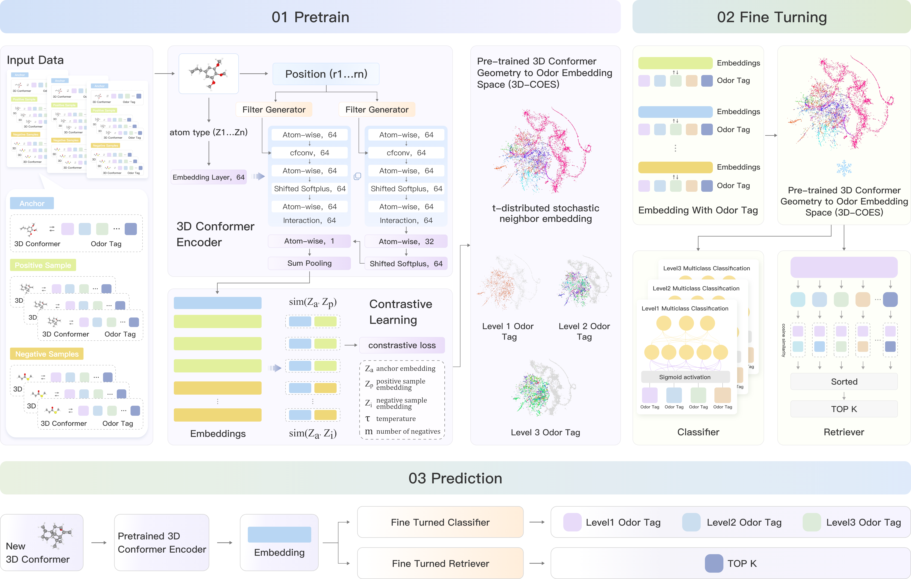
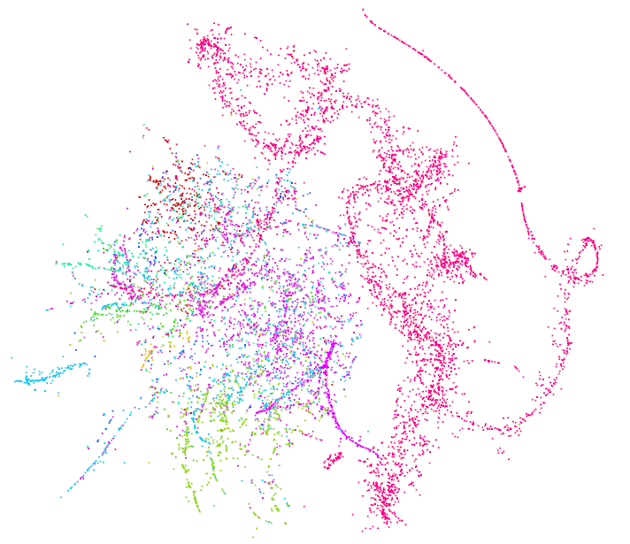
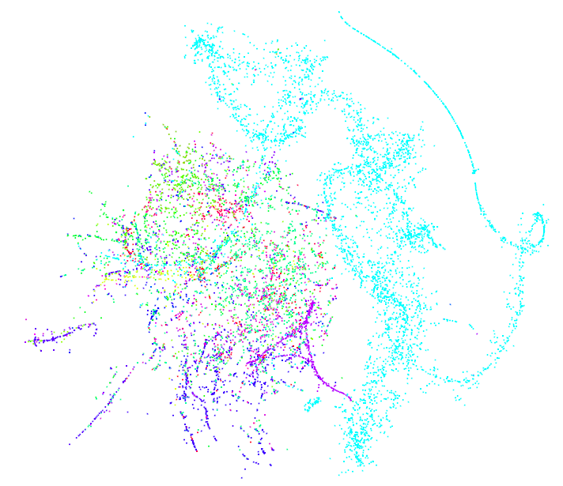
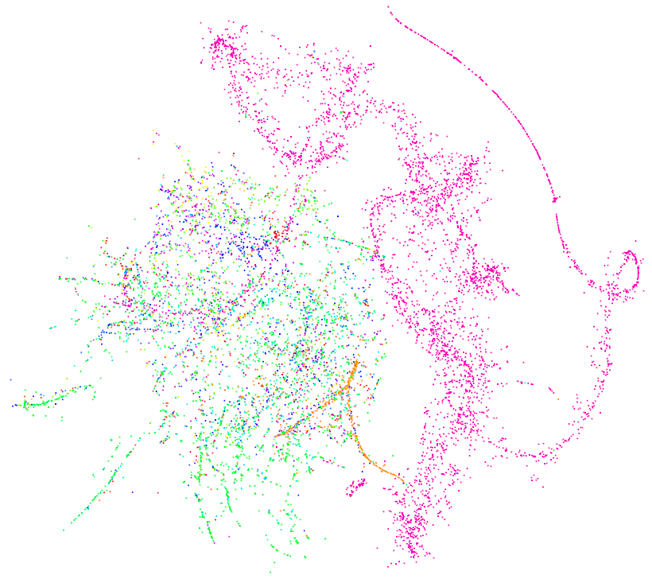

# FMO-3D: Towards a Foundation Model of Odor from 3D Molecular Structure

## Overview

Olfaction is one of the least understood human senses, driven by subtle 3D molecular conformations interacting with diverse olfactory receptors. Unlike vision or language, where foundation models have become standard, there is no unified representation space for odor-related tasks.

**FMO-3D** introduces a pre-trained framework that learns a **general-purpose odor embedding space** directly from molecular 3D conformers. By employing a **3D conformer encoder** and a **contrastive pre-training strategy**, FMO-3D aligns molecular structure with multi-level odor descriptors.

---

## Model Structure  



---

## 3D Conformer Odor Embedding Space Visualization

<table width="100%">
<tr>
<td align="center" width="33%">
  <br>
  <b>Level 1</b>
</td>
<td align="center" width="33%">
  <br>
  <b>Level 2</b>
</td>
<td align="center" width="33%">
  <br>
  <b>Level 3</b>
</td>
</tr>
</table>


---

## Getting Started

1. **Clone the repository**

   ```bash
   git clone https://github.com/your_username/FMO-3D.git
   cd FMO-3D
   ```

2. **Create environment**

   ```bash
   conda create -n GraphMVP python=3.7
   conda activate GraphMVP
   ```

3. **Install dependencies**

   ```bash
   conda install -y -c rdkit rdkit=2023.3.2
   conda install -y -c pytorch pytorch=1.9.1
   conda install -y numpy networkx scikit-learn
   pip install ase
   pip install git+https://github.com/bp-kelley/descriptastorus
   pip install ogb
   ```

4. **Install PyTorch Geometric**

   ```bash
   export TORCH=1.9.0
   export CUDA=cu102  # options: cu102, cu110

   wget https://data.pyg.org/whl/torch-${TORCH}%2B${CUDA}/torch_cluster-1.5.9-cp37-cp37m-linux_x86_64.whl
   pip install torch_cluster-1.5.9-cp37-cp37m-linux_x86_64.whl

   wget https://data.pyg.org/whl/torch-${TORCH}%2B${CUDA}/torch_scatter-2.0.9-cp37-cp37m-linux_x86_64.whl
   pip install torch_scatter-2.0.9-cp37-cp37m-linux_x86_64.whl

   wget https://data.pyg.org/whl/torch-${TORCH}%2B${CUDA}/torch_sparse-0.6.12-cp37-cp37m-linux_x86_64.whl
   pip install torch_sparse-0.6.12-cp37-cp37m-linux_x86_64.whl

   pip install torch_geometric==2.1.0
   ```

---

## Repository Structure

* `datasets/` : test sets and pre-trained embeddings
* `baseline/` : baseline model configurations and modifications
* `FMO-3D/` : main implementation code

---

## Dataset Preparation

To prepare the dataset, simply run the **preprocess script**:

```bash
cd smell_prediction
python GEOM_dataset_preparation.py --data_folder datasets/fmo_3d
```

* The generated directory name will be used later for model training.

---

## Embedding and Tasks

* Pre-trained embeddings:

  * `datasets/generated_embedding`
  * `datasets/generated_embedding_openpom`
* You can use these embeddings to reproduce results from the paper.

**Tasks**:

* Odor classification:

  ```bash
  python smell_prediction/classification.py
  ```
* Molecule retrieval:

  ```bash
  python smell_prediction/retrieve.py
  ```
* Ablation studies:

  ```bash
  python smell_prediction/pretrain_GraphGPT.py
  ```
  ```bash
  python smell_prediction/pretrain_graphcl.py
  ```


---

## Results

📌 *Insert three result figures here*

---

## Citation

---

## License

This project is released under the [MIT License](LICENSE).

---

